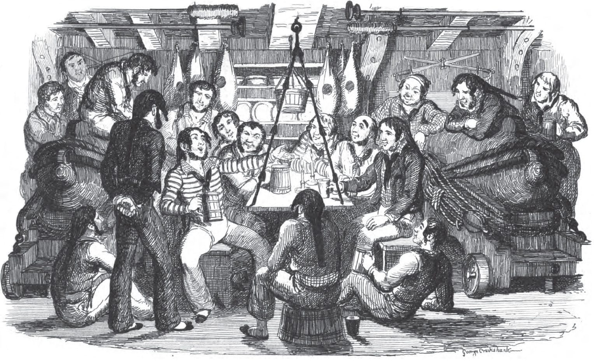

# Casting Neural Nets to Catch a Sea Shanty

#### Contents:
- [Introduction](#Introduction)
- [Data](#Data)
    * [Data Collection](#Data-Collection)
    * [Data Cleaning](#Data-Cleaning)
    * [Data Dictionary](#Data-Dictionary)
- [Modeling](#Modeling)
    * [Model Preparation](#Model-Preparation)
    * [Model Processing](#Model-Processing)
- [Results](#Results)
    * [Conclusions](#Conclusions)
    * [Recommendations and Next Steps](#Recommendations-and-Next-Steps)

## Introduction
Sea Shanties are a type of work song used on sailing vessels to help the crew keep in time for tasks such as hauling lines. For a more detailed history please refer to this [wikipedia](https://en.wikipedia.org/wiki/Sea_shanty) article.

One may wonder why spend the time to each a computer to write a sea shanty. To that I say what better way to showcase the capabilities of machine learning then to have a computer write a niche style of working song.

Also shanties are just fun to sing and so the world should have a few more.

## Data
Nerual nets are known to be very hungry for data so in order to collect enough for the net to learn from seveal different websites with shanty lyrics were scrapped.

Five sites listing the lyrics of shanties were searched, reviewed, then selected for scraping.
- https://www.contemplator.com/sea/
- https://www.karaoke-lyrics.net/lyrics/sea-shanty-56697
- https://www.sailorsongs.com/index.html
- http://www.shantynet.com/
- http://www.traditionalmusic.co.uk/sea-shanty/0sea-shanty.htm

### Data Collection
For each site a custom [web scraper](./code/scrapers) was written to pull the song title and the accompanying lyrics into a csv file.

The tools used for scraping were depending on how the sites were built. Primarily the python [requests](https://requests.readthedocs.io/en/master/) library was used but where sites had dynamic javascript the [selenium](https://www.selenium.dev/) webdriver was used as well.

### Data Cleaning
Each song was lower cased, had the punctuation removed, and was then added to the final corpus of lyrics.

## Modeling
[modeling-code](./code/model/model-building/model-building.ipynb)

Model inspiriation by Jason Brownlee at https://machinelearningmastery.com/text-generation-lstm-recurrent-neural-networks-python-keras/

### Model Preparation
Model preparation consisted of two main parts
- Telling the network how to review processed data
  - Converting characters to something a neural net can learn from
- Telling the network how to review processed data

#### Data Conversion
To convert the characters of the corpus into something machine readable a dictionary was created with each unique character being a key and with a number as the value.

Next the data was parsed into 50 character sequences then reshaped as an array. The sequence was then shifted one character, reshaped, and added to the training data set. This process was done for the entire corpus.

### Model Processing

A LSTM network was chosen for it's ability "remnember" or use previous pieces of data for the current output.

In an effort to prevent gibberish from being the output a robust dual layer LSTM with dropout was fitted.

## Results

Seed string to base predictions on:

"Washington DC is the best campus of General Assemb"

This forced the model to predict a character on a unfinished word.

For results by each epoch refer to [lyrics-generator](./code/model/lyric-generation/lyrics-generator.ipynb) notebook

-Epoch 1:
Washington DC is the best campus of General Assembn the sail the sailor sail the sailor sail the sailor sail the sailor sail the sailor sail the sailo

-Epoch 2:
Washington DC is the best campus of General Assembe the sailor s bootier she s a sailor s bootier the sailor s bootier she s a sailor s bootier the sa

-Epoch 7:
Washington DC is the best campus of General Assembe the sea and the whnds and she s a lan o come all you bold sea bott and she s in the sea and the wh

-Epoch 16:
Washington DC is the best campus of General Assember the sailor loves the sailor loves the bottle oh the sailor loves the bottle oh the sailor loves t

-Epoch 20:
Washington DC is the best campus of General Assember the sailor loves the sea and the ship the sailor loves the sea and the ship the sailor loves the

### Recommendations and Next Steps
- Rebuild with a less performant model
- Model with different sequence and step lengths
- Process data to use words rather then characters
- Enforce “uncertainty” in predictions
- Use Shanty corpus in a pre-trained model such as Gensim
